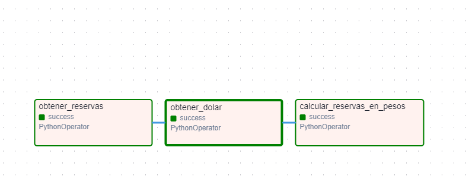
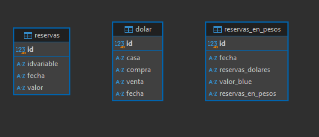
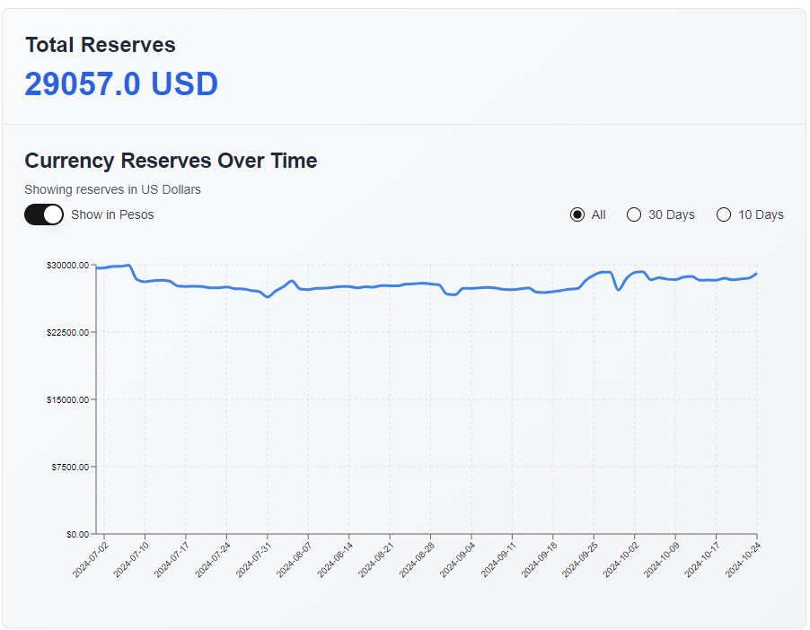
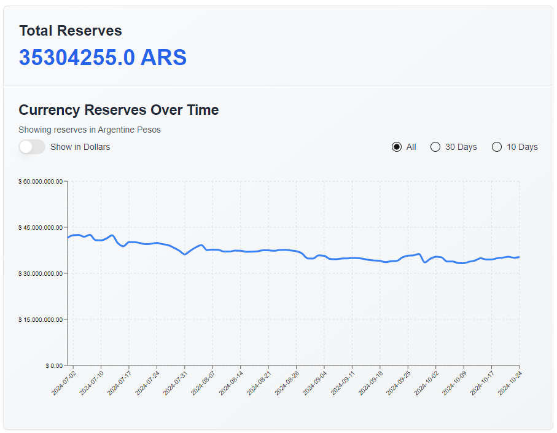

# ITBA-Trabajo-Final

Este proyecto es un pipeline de ETL (Extract, Transform, Load) utilizando Apache Airflow para obtener datos de reservas del Banco Central República Argentina (BCRA) y cotización del dólar "blue" desde APIs externas, transformarlos y almacenarlos en una base de datos Redshift para una posterior visualización de las reservas en dólares y en pesos en un gráfico en Next.Js.

## Descripción de Archivos y Carpetas

- **dags/**: Contiene los DAGs de Airflow y los scripts de ETL.
  - **reservas_dag.py**: Define el DAG principal para obtener y procesar datos de reservas y cotización del dólar.
  - **etl/**: Contiene los scripts de ETL.
    - **api_request.py**: Contiene funciones para obtener datos de reservas y cotización del dólar desde APIs externas.
    - **redshift_save.py**: Contiene la función para guardar datos en Redshift.
    - **transformations.py**: Contiene la función para transformar los datos de reservas y cotización del dólar.
- **tests/**: Contiene los archivos de prueba unitaria.
  - **test_api_request.py**: Pruebas unitarias para las funciones en `api_request.py`.
  - **test_redshift_save.py**: Pruebas unitarias para la función en `redshift_save.py`.
  - **test_transformations.py**: Pruebas unitarias para la función en `transformations.py`.
- **.github/workflows/**: Contiene los workflows de GitHub Actions.
  - **ci.yml**: Workflow de CI para ejecutar pruebas unitarias en GitHub Actions.
- **requirements.txt**: Lista de dependencias del proyecto.
- **config/**: Contiene archivos de configuración.
  - **.env**: Archivo de configuración con variables de entorno.

## Pre-Requisitos

- Docker instalado.

## Instalación

1. Clonar el repositorio: `git clone https://github.com/FrancoToretta26/ITBA-Trabajo-Final.git`
2. Ingresar a la carpeta ITBA-Trabajo-Final: `cd ITBA-Trabajo-Final`
3. Instala las dependencias: `pip install -r requirements.txt`
4. En la carpeta root del proyecto, crear la carpeta `config`.
5. Dentro de la carpeta `config` crear un archivo `.env`
6. Ingresar las credenciales que fueron enviadas por privado dentro del archivo `.env`.
7. Ejecutar en la terminal `docker compose up --build`.
8. Al finalizar la ejecución, ingresar a <http://localhost:8080>
9. Ingresar a Airflow mediante `user: airflow` `password: airflow`
10. Una vez finalizado la ejecución del DAG, dirigirse al siguiente repositorio y seguir los pasos: <https://github.com/FrancoToretta26/currency-reserves-chart>

## DAG de Airflow - Proceso ETL para Obtener y Calcular Reservas en Pesos

Este DAG ejecuta un proceso ETL que automatiza la obtención de datos de reservas internacionales del Banco Centraly el valor del dólar, para luego calcular las reservas en pesos. El DAG consta de las siguientes tareas:

**obtener_reservas:** Esta tarea ejecuta un PythonOperator que obtiene los datos de reservas internacionales desde una API externa. Los datos obtenidos se almacenan como un DataFrame y se pasan al siguiente paso mediante XComs.

**obtener_dolar:** Utiliza un PythonOperator para consultar el valor del dólar (Blue) a través de una API. Los datos son procesados y almacenados para ser usados en los cálculos posteriores. El valor del dólar se pasa como DataFrame utilizando XComs.

**calcular_reservas_en_pesos:** Esta tarea realiza la transformación final, combinando los datos de reservas y del dólar para calcular las reservas en pesos. El resultado final es almacenado en Redshift.Las reservas convertidas a pesos son enviadas y almacenadas en la base de datos de Redshift.

Cada tarea está enlazada secuencialmente, garantizando que se ejecuten de manera correcta y ordenada. En caso de fallo, el DAG permitirá reintentar las tareas desde el último punto exitoso.

## Tablas en Redshift

## Gráfico realizado en Next.Js

**ACTUALIZACIÓN**: Se modificó el estilo del gráfico y se agregaron filtros de días y las reservas totales.

**Histórico de reservas en Dólares.**

**Histórico de reservas en Pesos.**

## Testing unitario

Para ejecutar las pruebas unitarias, ejecutar el siguiente comando en el root del proyecto: `python -m unittest discover -s tests`
